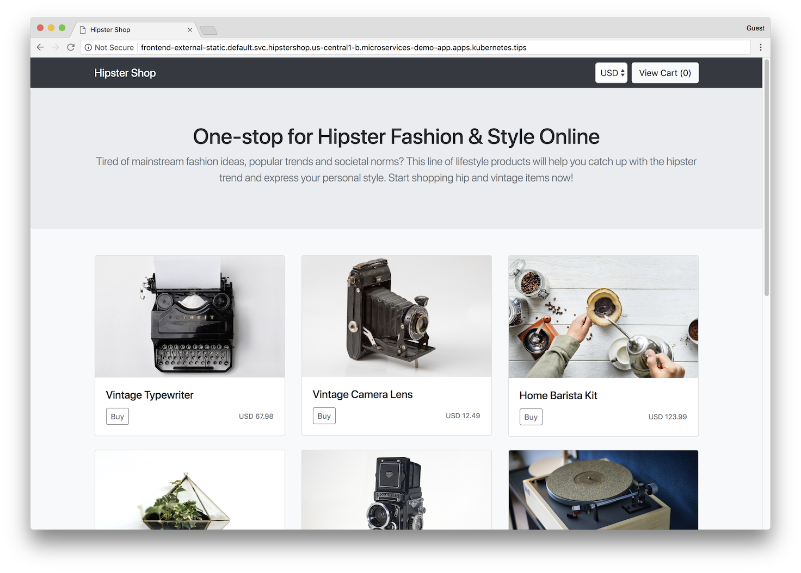
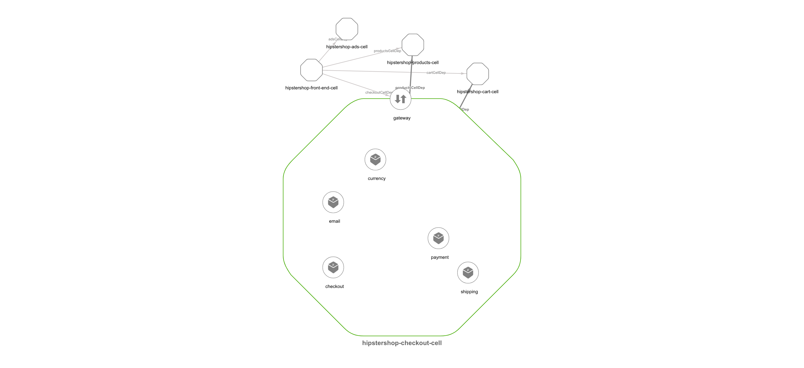
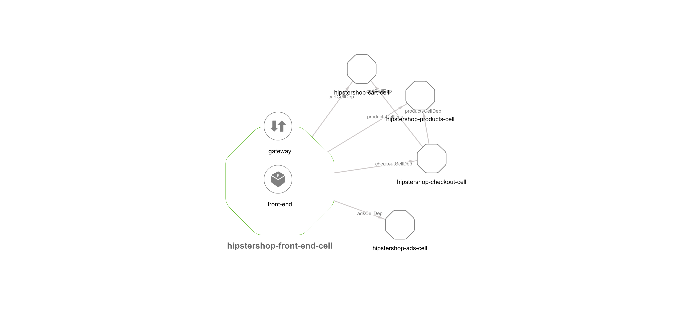

# Cell-based Hipster Shop Application

All details of the original Hipster Shop: Cloud-Native Microservices Demo Application can be found [here](https://github.com/GoogleCloudPlatform/microservices-demo). 

The Hipster Shop project contains a 10-tier microservices application. The application is a
web-based e-commerce app called **“Hipster Shop”** where users can browse items,
add them to the cart, and purchase them.

**Google uses this application to demonstrate use of technologies like
Kubernetes/GKE, Istio, Stackdriver, gRPC and OpenCensus**. This application
works on any Kubernetes cluster (such as a local one), as well as Google
Kubernetes Engine. 

## Screenshots

| Home Page                                                                                                         | Checkout Screen                                                                                                    |
| ----------------------------------------------------------------------------------------------------------------- | ------------------------------------------------------------------------------------------------------------------ |
|  |  |

| Checkout Cell                                                                                                         | Checkout Screen                                                                                                    |
| ----------------------------------------------------------------------------------------------------------------- | ------------------------------------------------------------------------------------------------------------------ |
|  |  |

## Service Architecture

**Hipster Shop** is composed of many microservices written in different
languages that talk to each other over gRPC.

| Service                                              | Language      | Description                                                                                                                       |
| ---------------------------------------------------- | ------------- | --------------------------------------------------------------------------------------------------------------------------------- |
| [frontend](./src/frontend)                           | Go            | Exposes an HTTP server to serve the website. Does not require signup/login and generates session IDs for all users automatically. |
| [cartservice](./src/cartservice)                     | C#            | Stores the items in the user's shipping cart in Redis and retrieves it.                                                           |
| [productcatalogservice](./src/productcatalogservice) | Go            | Provides the list of products from a JSON file and ability to search products and get individual products.                        |
| [currencyservice](./src/currencyservice)             | Node.js       | Converts one money amount to another currency. Uses real values fetched from European Central Bank. It's the highest QPS service. |
| [paymentservice](./src/paymentservice)               | Node.js       | Charges the given credit card info (mock) with the given amount and returns a transaction ID.                                     |
| [shippingservice](./src/shippingservice)             | Go            | Gives shipping cost estimates based on the shopping cart. Ships items to the given address (mock)                                 |
| [emailservice](./src/emailservice)                   | Python        | Sends users an order confirmation email (mock).                                                                                   |
| [checkoutservice](./src/checkoutservice)             | Go            | Retrieves user cart, prepares order and orchestrates the payment, shipping and the email notification.                            |
| [recommendationservice](./src/recommendationservice) | Python        | Recommends other products based on what's given in the cart.                                                                      |
| [adservice](./src/adservice)                         | Java          | Provides text ads based on given context words.                                                                                   |
| [loadgenerator](./src/loadgenerator)                 | Python/Locust | Continuously sends requests imitating realistic user shopping flows to the frontend.                                              |
## Cell Architecture

**Hipster Shop** is composed of many microservices written in different
languages that talk to each other over gRPC.

